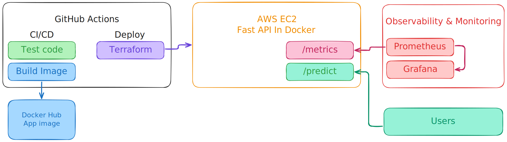

# Churn inference service

[](https://github.com/blue-slate/churn-inference-service/actions/workflows/ci.yml) [](https://github.com/blue-slate/churn-inference-service/actions/workflows/delivery.yml) [](https://github.com/blue-slate/churn-inference-service/actions/workflows/deploy.yml)

## Overview

This project is a production-inspired MLOps service for customer churn prediction.

It exposes a machine learning model through a **FastAPI API**, packages the service with **Docker**, provisions infrastructure with **Terraform**, and uses **GitHub Actions** for **CI/CD**. The project also includes **monitoring with Prometheus and Grafana** to reflect real-world deployment and reliability practices.

Its goal is not to build the most complex model, but to demonstrate how an ML service can be structured, deployed, monitored, and maintained in a clean and professional way.

**Tech stack:** FastAPI · scikit-learn · Docker · GitHub Actions · Terraform · AWS EC2 · Prometheus · Grafana

## Contents

- [Overview](#overview)
- [Architecture](#architecture)
- [Quickstart](#quickstart)
- [Features](#features)
- [CI/CD and Deployment](#cicd-and-deployment)
- [Monitoring](#monitoring)
- [Roadmap and Future Improvements](#roadmap-and-future-improvements)

## Architecture



The project is built as a simple *end-to-end ML service** with a deployment flow inspired by real-world production setups.

- A **FastAPI** application exposes the prediction API and operational endpoints
- A **scikit-learn pipeline** is loaded by the service to serve predictions
- The application is packaged and run in a **Docker** container
- **GitHub Actions** handles CI/CD tasks such as testing, linting, image build, and delivery
- **Terraform** provisions the AWS infrastructure
- The service is deployed on an **EC2 instance**
- **Prometheus** scrapes application metrics
- **Grafana** visualizes service health and performance through dashboards

At a high level, the system covers the full lifecycle of an ML service: packaging, deployment, delivery, monitoring, and basic production reliability practices.

## Quickstart

### Prerequisites

- Git
- Docker
- Make 4.3+
- Python 3.11+ *(only needed for local non-Docker execution)*

### Run locally

Clone the repository and start the API:

```bash
git clone https://github.com/blue-slate/churn-inference-service.git
cd churn-inference-service

make docker-build
make docker-run
```

If you prefer running with Python and uvicorn directly:

```bash
make install
make run
```

### Verify the service

Health check:

```bash
curl http://localhost:8000/health
```

API prediction:

```bash
curl -X 'POST' \
  'http://localhost:8000/predict' \
  -H 'accept: application/json' \
  -H 'Content-Type: application/json' \
  -d '{
  "gender": "Female",
  "SeniorCitizen": 0,
  "Partner": "Yes",
  "Dependents": "No",
  "tenure": 1,
  "PhoneService": "No",
  "MultipleLines": "No phone service",
  "InternetService": "DSL",
  "OnlineSecurity": "No",
  "OnlineBackup": "Yes",
  "DeviceProtection": "No",
  "TechSupport": "No",
  "StreamingTV": "No",
  "StreamingMovies": "No",
  "Contract": "Month-to-month",
  "PaperlessBilling": "Yes",
  "PaymentMethod": "Electronic check",
  "MonthlyCharges": 29.85,
  "TotalCharges": 29.85
}'
```

## Features

### ML service

- FastAPI inference service for customer churn prediction
- Inference endpoint exposed through `/predict`
- Operational endpoints: `/health`, `/model-info`, and `/metrics`

### Containerization and deployment

- Dockerized application for reproducible execution
- Infrastructure as Code with Terraform
- Deployment to an AWS EC2 instance
- CI/CD workflow with GitHub Actions for testing, build, delivery, and deployment steps

### Monitoring and operations

- Prometheus metrics collection
- Grafana dashboards for request volume, latency, and service health

### Production-readiness

- Automated testing to catch failures early
- Clean configuration and secrets handling

## CI/CD and Deployment

GitHub Actions is used to automate the main delivery steps of the project:

- The pipeline runs code quality checks and tests to validate changes before deployment  
- It then builds the application Docker image in a reproducible way  
- On the appropriate branch or workflow trigger, the image is pushed to Docker Hub

This keeps the service packaged consistently across development and deployment environments.

### Deployment

Deployment is automated with Terraform on an AWS EC2 instance.

- On push to `main`, GitHub Actions runs the deploy workflow
- The deploy workflow uses Terraform to provision the required infrastructure (VPC, security group, route tables, EC2)
- During deployment, the EC2 instance pulls the application image and runs the FastAPI service in Docker

This setup keeps infrastructure changes versioned and reproducible.  
It also makes the project easier to maintain, redeploy, and evolve over time.

## Monitoring

> _Monitoring is currently being implemented and is already available in the local development stack._

The application exposes Prometheus metrics through the `/metrics` endpoint, and the project includes a Docker Compose setup to run both Prometheus and Grafana.

This allows the collection and visualization of key API signals such as request volume, latency, error rate, and service health during local runs.

Example Grafana dashboard from the local development monitoring stack:  


The next step is to connect the monitoring components to the deployed environment and add persistent storage for time-series retention.

### Local setup

You may run the monitoring stack locally with:

```bash
make docker-build
cd monitoring
docker compose up -d
```

In the local environment, Grafana uses the default credentials.

## Roadmap and Future Improvements

To extend the project further, the next steps would focus on reliability, scalability, and safer delivery practices:

- Finalize monitoring integration in the **deployed environment** and add **structured logging**
- Add **post-deployment smoke tests** to validate application health and core prediction flows
- Introduce **automatic rollback** when a new version fails smoke tests
- Add **auto-scaling** to improve elasticity under changing traffic conditions
- Apply additional **security hardening** across infrastructure, runtime, and configuration management
- Deploy the service on **Kubernetes** to support more advanced orchestration patterns
- Implement advanced **alerting** for failures, latency degradation, and service instability
- Explore **canary deployments** for safer progressive rollouts

These changes would strengthen the project’s operational maturity while keeping the architecture aligned with real-world MLOps and DevOps practices.

***
